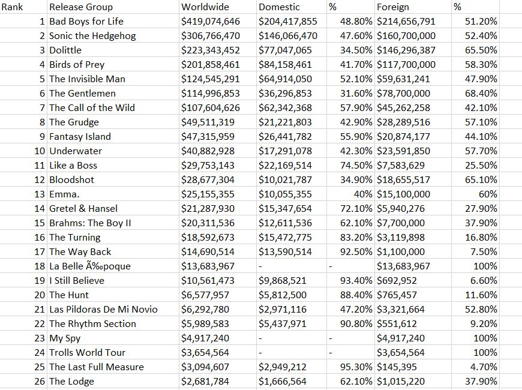

# Scraper
A scraper script which is running on python's framework Flask and Fast Api can scrape BoxOfficeMojo website. We are using the Ngrok to deploy our localhost to web.

### Web preview


### What we are going to build?
1. We are creating a script to scrape the BoxOfficeMojo and export it to excel using the [pandas library](https://pandas.pydata.org/) by making Dataframe using the nested dictionary.

2. Then, setting up the [Flask](https://flask.palletsprojects.com/en/2.0.x/) Server to run periodic scraping using the get request on a particular url endpoint after a certain interval of time.

3. Then, making a url endpoint to serve the data which we had scraped till now.

4. We are making our localhost server accessible from anywhere using the [Ngrok](https://ngrok.com/).

5. Lastly, We are making a cmdlet or powershell script to run from anywhere wether command prompt or window power shell.

## Step 1 -> Writing scraper and exporting data (Scraper.py)
### Writing scraper
We will use requestsHTML to scrape the data with the help of css selectors.

<strong>But, What are selectors/locators?</strong>

A CSS Selector is a combination of an element selector and a value which identifies the web element within a web page.

<b>The choice of locator depends largely on your Application Under Test</b>

<b>Id</b>
An element’s id in XPATH is defined using: “[@id='example']” and in CSS using: “#” - ID's must be unique within the DOM.
Examples:
```
XPath: //div[@id='example']
CSS: #example
```

<b>Element Type</b>
The previous example showed //div in the xpath. That is the element type, which could be input for a text box or button, img for an image, or "a" for a link. 

```
Xpath: //input or
Css: =input
```

<b>Direct Child</b>
HTML pages are structured like XML, with children nested inside of parents. If you can locate, for example, the first link within a div, you can construct a string to reach it. A direct child in XPATH is defined by the use of a “/“, while on CSS, it’s defined using “>”. 
Examples:
```                        
XPath: //div/a
CSS: div > a
```

<b>Child or Sub-Child</b>
Writing nested divs can get tiring - and result in code that is brittle. Sometimes you expect the code to change, or want to skip layers. If an element could be inside another or one of its children, it’s defined in XPATH using “//” and in CSS just by a whitespace.
Examples:
```
XPath: //div//a
CSS: div a
```

<b>Class</b>
For classes, things are pretty similar in XPATH: “[@class='example']” while in CSS it’s just “.” 
Examples:
```
XPath: //div[@class='example']
CSS: .example
```

<strong>Libraries Required :-</strong>
<ol>
    <li>Request-html</li>
    <li>Requests</li>
    <li>Pandas</li>
</ol>

<strong>So, How to install them ?</strong>
Run the following commands in python shell
```
pip install requests-html
pip install requests
pip install pandas
```

<strong>Getting the html code using the Requests library</strong>

It will take the filename as the keyword argument if save data is true. By default it will not save the html code in a file.

We are making a get request then we check for the response  status code. if status_code is in range(200,299) then its Ok.
Then the html code is feed into `pharse_and_extract` function
```
def url_to_text(url, filename="world.html", save=False):
    r = requests.get(url)
    if r.status_code == 200:
    html_text = r.text
    if save:
    with open(filename, 'w') as f:
    f.write(html_text)
    return html_text
    return None
```

<strong>Html Parsing</strong>

The response code is parsed into html code using the requestsHTML HTML parser.
```
def pharse_and_extract(url, name=2020):
    html_text = url_to_text(url)
    if html_text is None:
    return ""
    r_html = HTML(html=html_text)
```

<strong>Scraping</strong>

We will use the css selectors to locate the element and get the required data.
```
def pharse_and_extract(url, name=2020):
    html_text = url_to_text(url)
    if html_text is None:
    return ""
    r_html = HTML(html=html_text)

    # scraping starts from here

    table_class = ".imdb-scroll-table"
    r_table = r_html.find(table_class)
    table_data = []

    if len(r_table) == 1:
    table = r_table[0]
    header_col = table.find("th")
    header_names = [x.text for x in header_col]
    rows = table.find("tr")
    for row in rows[1:]:
    cols = row.find("td")
    row_data = []
    for i, col in enumerate(cols):
    row_data.append(col.text)
    table_data.append(row_data)
```

<strong>Exporting into CSV file</strong>

Once the data is scraped, then it is loaded into Pandas Dataframe and then exported into CSV file.
```
def pharse_and_extract(url, name=2020):
    html_text = url_to_text(url)
    if html_text is None:
    return ""
    r_html = HTML(html=html_text)
    table_class = ".imdb-scroll-table"
    r_table = r_html.find(table_class)
    table_data = []

    if len(r_table) == 1:
    table = r_table[0]
    header_col = table.find("th")
    header_names = [x.text for x in header_col]
    rows = table.find("tr")
    for row in rows[1:]:
    cols = row.find("td")
    row_data = []
    for i, col in enumerate(cols):
    row_data.append(col.text)
    table_data.append(row_data)

    # exporting data starts from here

    path = os.path.join(BASE_DIR, 'data')
    os.makedirs(path, exist_ok=True)
    filepath = os.path.join('data', f'{name}.csv')

    # loading into dataframe
    df = pd.DataFrame(table_data, columns=header_names)
    df.to_csv(filepath, index=False)
```

## Step 2 -> Setting up Flask Server

We are making a url endpoint, so that we can set up periodic scraping through a post request.
```
from flask import Flask
from scraper import run as scraper_runner
from logger import log_save

app = Flask(__name__)

@app.route("/box-office", methods=['POST'])
def box_office_view():
    log_save()
    scraper_runner()
    return "done"
```
## Step 3 -> Serving the scraped data using FastAPI
we will load the data into dataframe from a csv file and then return a dictionary data to the forntend
```
from fastapi import FastAPI
from scraper import run as scraper_runner
from logger import log_save
import os
import pandas as pd

app = FastAPI()

# Getting the file location

current = (os.path.join(os.getcwd(), 'data'))
os.makedirs(current, exist_ok=True)
file = os.path.join(current, "box_office_cleaned.csv")

# Serving the file on a get request

@app.get("/box-office-collect")
def abc():
    df = pd.read_csv(file)
    return df.to_dict("Rank")

```
We can even setup periodic scraping in FastAPI too by simple command given below -:
```
@app.post("/box-office")
def box_office():
    log_save()
    scraper_runner()
    return {"data": "success"}

```

## Step 4 -> Deployment  
For deployment,  We are using the <strong>Ngrok</strong> to deploy our localhost to web.<span><a href="https://ngrok.com/">For More Info</a></span>
Make a python file (trigger.py)
Once our flask server is exposed through ngrok then we can make a post request to make a periodic scraping. We can use tools for that purpose like :-
<ol>
    <li>UptimeRobot</li>
    <li>Freshworks</li>
    <li>Uptrends</li>
</ol>
```
import requests

url = "http://9d44e5091b7d.ngrok.io"
endpoint = f'{url}/box-office'
r = requests.post(endpoint, json={})
print(r.text)
    
```

## Step 5 -> Making a ps1 script
It will help us to run command from anywhere like cmd, powershell etc

<b>Make a file with ps1 extension</b>
<strong>For Flask Server</strong>
```
set FLASK_APP=flask_server.py
$env:FLASK_APP = "flask_server.py"
flask run --host=127.0.0.1 --port=8000
```

<strong>For FastAPI Server</strong>
```
uvicorn fast_server:app --port 8888
```